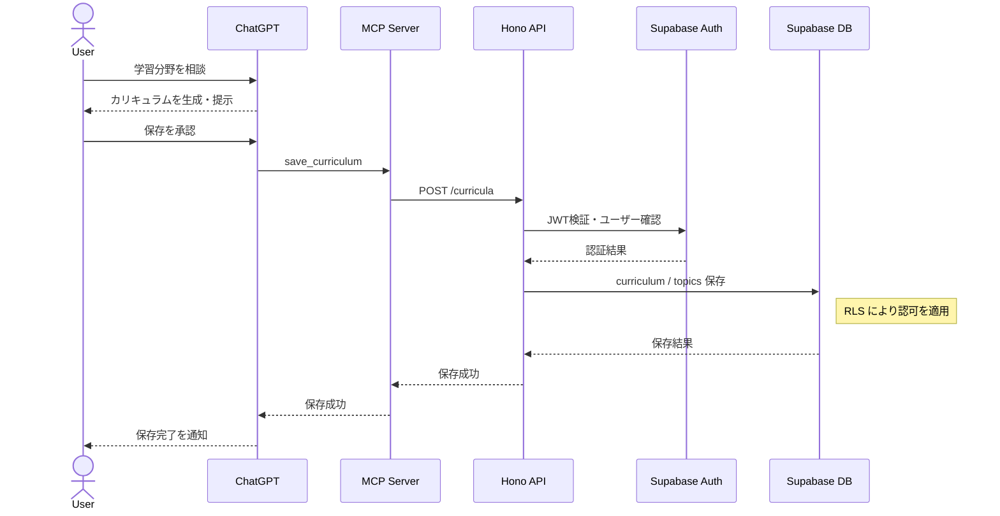
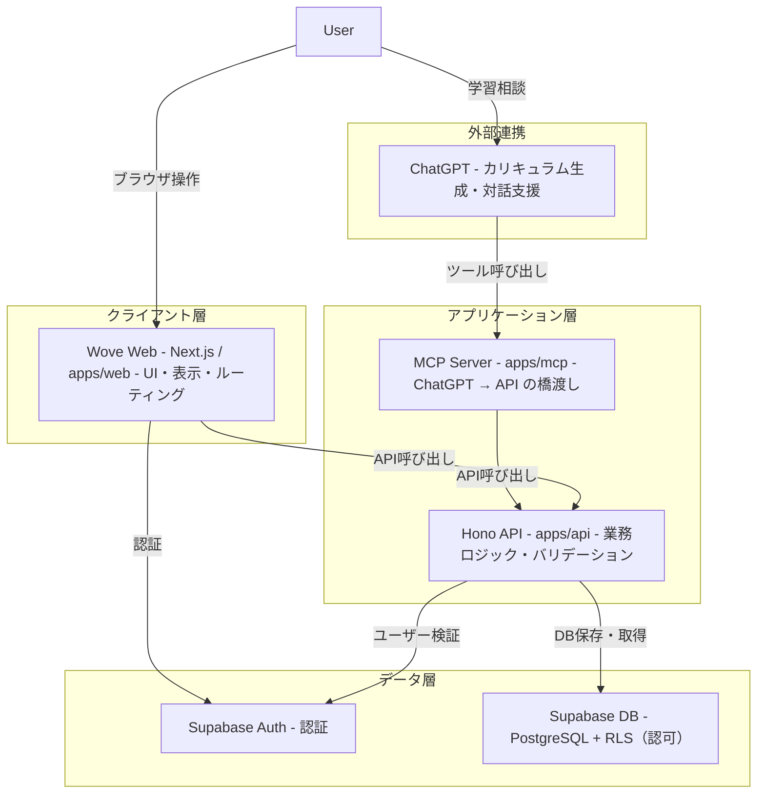

# Wove

**Structured learning, designed with AI**

ChatGPTでの学習を、構造化して保存・継続できる学習支援アプリ。

---

## 概要

Woveは、ChatGPTで行った学習を「その場限り」で終わらせず、  
構造化して保存し、再利用・再開できる状態にするアプリです。

多くのAI学習は便利な一方で、次のような課題があります。

- 学習が断片的になりやすい
- 内容が蓄積されない
- 途中から再開しにくい

Woveはそれを解決し、  
学習を「流れるもの」から「積み上がる資産」に変えることを目的としています。

---

## コアコンセプト

Woveは役割を明確に分離しています。

- **ChatGPT**: 生成・対話・理解支援
- **Wove**: 保存・構造化・可視化・継続管理

つまり、

- AIは「考える」
- Woveは「蓄積する」

という関係です。

---

## 利用フロー

1. ChatGPTで学習カリキュラムを作成
2. ユーザーが保存を承認
3. MCP経由でカリキュラムをアプリに保存
4. アプリで一覧・詳細を確認
5. トピックごとに学習し、要約を保存
6. 後日、途中から再開

最小構成として、  
**「カリキュラム → トピック → 要約 → 進捗」** の流れを通すことを重視しています。

---

### カリキュラム保存フロー

以下は、ChatGPTで作成したカリキュラムをWoveに保存する際の主要な処理フローです。
認証は Supabase Auth、認可は PostgreSQL の RLS により行われます。



---

## アーキテクチャ

Woveは、外部AI・クライアント・アプリケーション・データ層を分離した構成を採用しています。
以下は、主要コンポーネントとその接続関係を示したものです。



この構成により、AIによる生成、Webでの操作、APIでの業務処理、DBでの永続化とアクセス制御を分離しています。

---

## このアーキテクチャを採用した理由

Woveでは、AIによる生成とアプリケーションによるデータ管理を明確に分離することを重視しています。

ChatGPTは学習内容の生成や対話を担いますが、その結果はその場限りで流れてしまう性質があります。  
Woveはその結果を構造化して保存し、再利用・再開できる状態にする役割を持ちます。

この役割分担を実現するために、以下のような構成を採用しています。

- フロントエンドとAPIを分離し、UIと業務ロジックの責務を明確化
- MCP Serverを介して、ChatGPTからの操作とアプリケーションの処理を分離
- データの永続化とアクセス制御をSupabaseに集約し、認証・認可を一元管理

これにより、AIによる柔軟な生成と、アプリケーションとしての一貫したデータ管理を両立できる構成としています。

---

## 技術スタック

- TypeScript
- Next.js (App Router) / React
- Hono
- Supabase (PostgreSQL + Auth)
- MCP (ChatGPT連携)
- Tailwind CSS / shadcn/ui

---

## リポジトリ構成

```txt
apps/
  web/   # Next.js frontend
  api/   # Hono backend API
  mcp/   # MCP server
docs/
```

モノレポ構成を採用し、  
フロント・API・MCPを一体として管理しています。

---

## 現在のフェーズ

現在は **Phase4: MCP / AI接続フェーズ** です。

- ChatGPT → MCP → API → DB の保存フローを構築中
- 最初は「カリキュラム保存」のみ対応

（ここは今後随時更新）

---

## データベース概要

### 主なエンティティ

- `profiles`
- `curricula`
- `topics`
- `summaries`

### 特徴

- `topics`: 学習状態（`status`）を保持
- `summaries`: 履歴として分離
- RLSによりユーザー単位でデータ管理

（ここは詳細をdocsに分離予定）

---

## 補足

- 本プロジェクトは現在開発中です
- アーキテクチャや設計は今後改善予定です
- 詳細設計は `docs` に分離予定です
